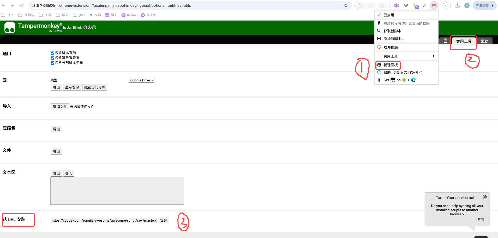

简介:下载JWS数据 

说明：

1.安装浏览器脚本插件 

* Tampermonkey (新油猴) (又名:篡改猴) *<a href="https://www.tampermonkey.net/">插件安装链接</a>  
* Script Cat (脚本猫) (中国社区开发) *<a href="https://docs.scriptcat.org/">插件安装链接</a>
* Violentmonkey (暴力猴) *<a href="https://violentmonkey.github.io/get-it/">插件安装链接</a> 
* Greasemonkey (旧油猴) *<a href="https://addons.mozilla.org/firefox/addon/greasemonkey/">插件安装链接</a>   注：Greasemonkey (旧油猴) 可能由于过于古老，无法支持该脚本。 

2.安装脚本 

打开油猴-管理面板-使用工具-从URL安装。输入如下URL:https://jidudev.com/rongjie-awesome/awesome-script/raw/master/JWS%20Data%20Exporter/JWS_Data_Exporter.js

3.使用

正常输入SQL->运行->导出数据->选择导出格式
