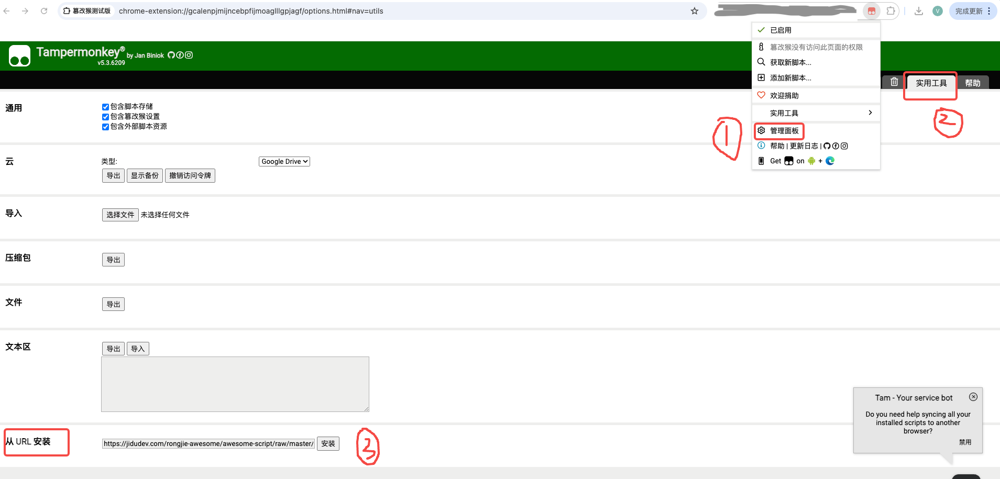

# Awesome Scripts

这是一个包含各种实用脚本的集合，旨在帮助自动化日常任务和简化工作流程。

## 如何使用浏览器脚本 (Tampermonkey/Violentmonkey)

许多脚本是为浏览器设计的，需要通过浏览器扩展（如 Tampermonkey 或 Violentmonkey）来运行。

1. **安装扩展**: 在您的浏览器（Chrome, Firefox, Edge 等）中安装 Tampermonkey 或 Violentmonkey 扩展。
* Tampermonkey (新油猴) (又名:篡改猴) *<a href="https://www.tampermonkey.net/">插件安装链接</a>  
* Script Cat (脚本猫) (中国社区开发) *<a href="https://docs.scriptcat.org/">插件安装链接</a>
* Violentmonkey (暴力猴) *<a href="https://violentmonkey.github.io/get-it/">插件安装链接</a> 
* Greasemonkey (旧油猴) *<a href="https://addons.mozilla.org/firefox/addon/greasemonkey/">插件安装链接</a>   注：Greasemonkey (旧油猴) 可能由于过于古老，无法支持该脚本。 

2. **安装脚本**
* 直接安装

打开油猴-管理面板-使用工具-从URL安装。输入脚本的URL即可。
也可采用如下的手动粘贴代码方式。

* 手动粘贴
    * 创建新脚本*: 打开扩展的仪表板，点击“创建新脚本”或类似选项。
    *  粘贴代码: 将 `.js` 文件的内容复制并粘贴到新脚本的编辑器中。
    *  保存: 保存脚本。
    *  启用: 确保脚本已启用。当您访问脚本指定的网站时，它将自动运行。

## 目录

- [独立脚本](#独立脚本)
  - [removeXAd.js](#removexadjs)
- [项目](#项目)
  - [Enetedu 脚本](#enetedu-脚本)
  - [Iflytek 视频速度控制](#iflytek-视频速度控制)
  - [JWS 数据导出器](#jws-数据导出器)
  - [SQL 生成器助手](#sql-生成器助手)
  - [推特X工具箱](#推特x工具箱)
  - [微博自动评论](#微博自动评论)

---

## 独立脚本

### removeXAd.js

**描述**: 这个脚本可能用于移除网页中的广告元素。

**使用方法**:
1. 将脚本内容复制到您的浏览器扩展（如 Tampermonkey 或 Violentmonkey）中。
2. 访问您想要移除广告的网页。
3. 脚本将自动执行并尝试移除广告。

---

## 项目

### Enetedu 脚本

**描述**: 此目录包含与 Enetedu 平台相关的脚本，可能用于自动化学习过程或解决特定问题。

**文件**:
- `enetedu.js`: 主要的 JavaScript 脚本。
- `recognize_captcha.py`: Python 脚本，可能用于识别验证码。

**使用方法**:
请参考 `enetedu/` 目录下的具体说明（如果存在）。您可能需要同时运行 JavaScript 和 Python 脚本以获得完整功能。

---

### Iflytek 视频速度控制

**描述**: 此脚本旨在控制 Iflytek 平台上的视频播放速度。

**文件**:
- `control21tbVideoSpeed.js`: 用于控制视频速度的 JavaScript 脚本。

**使用方法**:
1. 将脚本内容复制到您的浏览器扩展（如 Tampermonkey 或 Violentmonkey）中。
2. 访问 Iflytek 平台上的视频页面。
3. 脚本将提供控制视频播放速度的功能。

---

### JWS 数据导出器

**描述**: 这是一个用于导出 JWS (JSON Web Signature) 数据的工具。

**文件**:
- `JWS_Data_Exporter.js`: 主要的 JavaScript 脚本。
- `exportJWS.py`, `process.py`: Python 脚本，可能用于数据处理和导出。
- `ReadMe.md`: 详细的使用说明。

**使用方法**:
请参阅 `JWS Data Exporter/ReadMe.md` 文件以获取详细的安装和使用说明。

---

### SQL 生成器助手

**描述**: 这是一个帮助生成 SQL 语句的工具。

**文件**:
- `SQLGeneratorHelper.py`, `SQLGeneratorHelper2.py`: 主要的 Python 脚本。
- `config.py`: 配置文件。
- `README.md`: 详细的使用说明。

**使用方法**:
请参阅 `SQLGeneratorHelper/README.md` 文件以获取详细的安装和使用说明。

---

### 推特X工具箱

**描述**: 强大的推特/X多功能工具箱，集成屏蔽评论者、AI智能总结等功能，未来将持续扩展更多实用工具。

**功能特点**:

🚫 **屏蔽评论者功能**:
- 🎯 一键屏蔽某条推文下的所有评论者
- 🔄 自动滚动加载所有评论
- 📊 实时显示处理进度
- ✅ 统计成功和失败数量
- ⚙️ 可配置是否排除原推作者

🤖 **AI智能总结功能**:
- 📝 总结推文内容和评论，分析讨论热点（推文详情页）
- 👤 总结用户推文，分析发言风格（用户主页）
- 🌐 支持OpenAI兼容的API（OpenAI、Azure、本地部署等）
- 🎨 精美的结果展示面板，支持全屏和复制

🌍 **通用特性**:
- 🌐 多语言支持（中文/英文）
- 🎨 精美的悬浮按钮界面
- ⚙️ 丰富的配置选项

**文件**:
- `twitter_x_toolkit.user.js`: 主要的油猴脚本
- `README.md`: 英文使用说明
- `README_zh.md`: 中文使用说明

**使用方法**:

*屏蔽功能*:
1. 安装 Tampermonkey 浏览器扩展
2. 安装脚本并配置
3. 打开推特/X的推文详情页
4. 点击"🚫 屏蔽所有评论者"按钮

*AI总结功能*:
1. 在配置面板（TwitterXToolkit）中设置 OpenAI API Key 和相关配置
2. 打开推文详情页或用户主页
3. 点击"🤖 AI总结"按钮
4. 等待生成总结并在暗色主题面板中查看结果

**注意事项**: 屏蔽操作不可撤销，AI总结功能需要配置有效的OpenAI API Key。详细说明请参阅 `twitter/README.md`（[中文文档](twitter/README_zh.md)）。

---

### 微博自动评论

**描述**: 这是一个用于自动化微博评论的脚本。

**文件**:
- `weibo_auto_comment.js`: 主要的 JavaScript 脚本。
- `ReadMe.md`: 详细的使用说明。

**使用方法**:
请参阅 `weiboAutoComment/ReadMe.md` 文件以获取详细的安装和使用说明。

---

