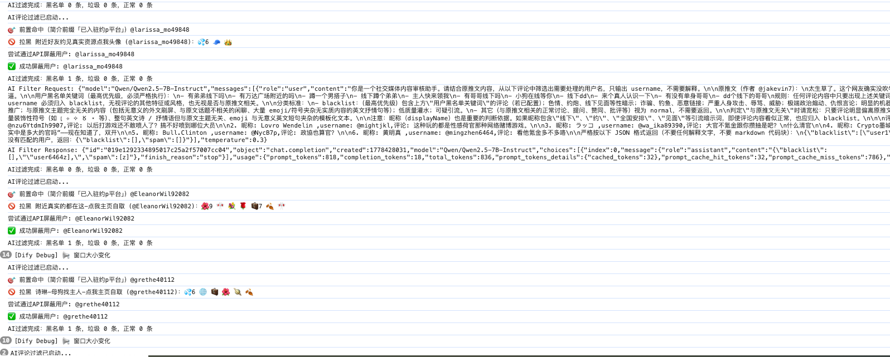
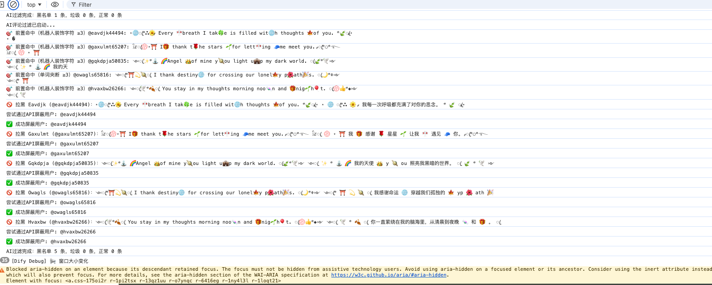
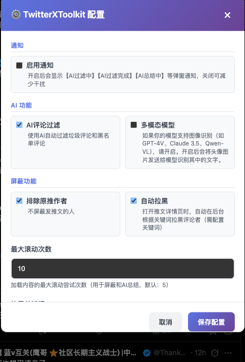

# 推特X工具箱

一个强大的推特/X多功能工具箱，集成屏蔽评论者、AI智能总结等功能，未来将持续扩展更多实用工具。

## 功能特点

### 🚫 一键屏蔽评论者

- 🎯 一键屏蔽某条推文下的所有评论者
- 🔍 **关键词过滤**：只屏蔽评论中包含特定关键词的用户
- 🤖 **自动拉黑模式**：打开推文详情页时自动在后台根据关键词拉黑评论者（可选）
- 🔄 自动滚动加载所有评论
- 📊 实时显示处理进度，展示详细的用户列表
- ✅ 统计成功和失败数量
- ⚙️ 可配置是否排除原推作者

  
  

### 🤖 AI智能总结

- 📝 **推文详情页**：总结推文内容及评论，分析评论观点分布和讨论热点
- 👤 **用户主页**：总结用户的推文，分析用户关注话题和发言风格
- 🌐 支持自定义OpenAI兼容的API（OpenAI、Azure、本地部署等）
- 📊 可配置最大加载页数，控制内容量
- 🎨 精美的结果展示面板，支持全屏和复制

### 🌍 通用特性

- 🌐 多语言支持（中文/英文）- 自动检测系统语言
- 🎨 精美的悬浮按钮界面
- ⚙️ 丰富的配置选项

## 安装方法

### 1. 安装油猴插件

首先需要在浏览器中安装 Tampermonkey 扩展：

- **Chrome/Edge**: [Chrome 网上应用店](https://chrome.google.com/webstore/detail/tampermonkey/dhdgffkkebhmkfjojejmpbldmpobfkfo)
- **Firefox**: [Firefox 附加组件](https://addons.mozilla.org/zh-CN/firefox/addon/tampermonkey/)
- **Safari**: [Mac App Store](https://apps.apple.com/app/tampermonkey/id1482490089)

### 2. 安装脚本

安装完 Tampermonkey 后：

1. 点击浏览器工具栏中的 Tampermonkey 图标
2. 选择"添加新脚本"
3. 将 `twitter_x_toolkit.user.js` 文件中的代码完整复制粘贴到编辑器中或导入<https://github.com/xixiU/awesome-script/raw/refs/heads/master/twitter/twitter_x_toolkit.user.js链接>
4. 按 `Ctrl + S`（Mac: `Cmd + S`）保存

## 使用方法

### 功能一：屏蔽评论者

#### 1. 打开推文详情页

在推特/X上打开任意一条推文的详情页（URL格式：`https://x.com/用户名/status/推文ID`）

#### 2. 点击屏蔽按钮

页面右上角会出现紫色渐变的悬浮按钮 **"🚫 屏蔽所有评论者"**

#### 3. 确认并执行

点击按钮后确认，脚本将：

1. 自动滚动加载所有评论
2. 提取所有评论者的用户名
3. 逐个屏蔽每位评论者
4. 显示实时进度和统计信息

### 功能二：AI智能总结

#### 1. 配置AI API（首次使用）

点击油猴图标 → 脚本设置 → ⚙️ 打开TwitterXToolkit配置，设置：

- **OpenAI API地址**：API基础地址（如：`https://api.openai.com/v1`）
- **API密钥**：你的OpenAI API Key
- **AI模型**：模型名称（如：`gpt-3.5-turbo`、`gpt-4`）
- **最大滚动次数**：控制加载内容的次数（默认：10，范围：1-50）

#### 2. 使用AI总结

**在推文详情页**：

- 点击粉色渐变的 **"🤖 AI总结"** 按钮
- 脚本将自动加载推文和评论，并生成总结
- 总结内容包括：原推核心观点、评论观点分布、讨论热点、舆论倾向

**在用户主页**：

- 点击 **"🤖 AI总结"** 按钮
- 脚本将加载用户的推文，并生成总结
- 总结内容包括：主要关注话题、发言风格、核心观点、活跃主题

#### 3. 查看和操作结果

总结完成后将弹出结果面板，支持：

- 📄 **复制**：一键复制总结内容
- 🖥️ **全屏**：全屏查看总结
- ❌ **关闭**：关闭结果面板

## 配置选项

点击油猴图标 → 脚本设置 → ⚙️ 打开TwitterXToolkit配置，可进行以下设置：

  

### 通用配置

- **排除原推作者**：不屏蔽发推文的人（默认：开启）
- **自动拉黑**：打开推文详情页时自动在后台根据关键词拉黑评论者（默认：关闭，需配置关键词）
- **最大滚动次数**：加载内容的最大滚动尝试次数，用于屏蔽功能和AI总结功能（默认：5，范围：1-50）

### 拉黑关键词配置

- **拉黑关键词**：只拉黑评论中包含这些关键词的用户（每行一个）。留空则拉黑所有评论者。
  - 默认预设了常见黄推/骚扰词汇
  - 点击屏蔽按钮时，确认弹窗会展示当前生效的关键词

### AI总结功能配置

- **OpenAI API地址**：OpenAI兼容的API基础地址（默认：`https://api.openai.com/v1`）
- **API密钥**：你的OpenAI API Key（必填）
- **AI模型**：使用的模型名称（默认：`gpt-3.5-turbo`）

## 注意事项

⚠️ **重要提示**：

### 屏蔽功能

1. **不可撤销**：屏蔽操作完成后，需要手动到设置中解除屏蔽
2. **速率限制**：脚本已内置延迟（每个用户间隔1秒），避免触发推特的速率限制
3. **仅限详情页**：屏蔽功能必须在推文详情页使用
4. **谨慎使用**：建议只在真正需要的时候使用，避免误伤无辜用户

### AI总结功能

1. **API密钥安全**：请妥善保管你的API Key，不要分享给他人
2. **API费用**：使用OpenAI API会产生费用，请注意控制使用量
3. **兼容性**：支持所有OpenAI兼容的API服务（如Azure OpenAI、本地部署的模型等）
4. **加载时间**：根据内容量和网络情况，总结可能需要10-60秒
5. **权限要求**：需要登录推特账号才能查看内容

## 工作原理

### 屏蔽功能

1. **评论加载**：自动滚动页面，触发推特的懒加载机制，加载更多评论
2. **用户识别**：解析页面DOM结构，提取所有评论者的用户名
3. **UI操作**：模拟用户点击操作（点击"..."菜单 → 点击"屏蔽" → 确认屏蔽）
4. **进度反馈**：实时更新按钮状态，显示处理进度

### AI总结功能

1. **页面类型检测**：自动识别当前页面类型（推文详情页/用户主页）
2. **内容提取**：
   - 推文详情页：提取原推内容 + 自动滚动加载评论
   - 用户主页：自动滚动加载用户的推文
3. **内容组织**：将提取的内容格式化为结构化数据
4. **API调用**：调用OpenAI兼容的API进行智能总结
5. **结果展示**：在精美的面板中展示Markdown格式的总结结果

## 技术栈

- 原生 JavaScript
- Tampermonkey GM API
  - `GM_setValue` / `GM_getValue`：持久化配置存储
  - `GM_xmlhttpRequest`：跨域API调用
  - `GM_addStyle`：注入样式
  - `GM_registerMenuCommand`：注册菜单命令
- DOM 操作
- MutationObserver（监听路由变化）
- OpenAI API（通过代理支持各种兼容的AI服务）

## 常见问题

### 屏蔽功能相关

#### Q: 为什么有些用户屏蔽失败？

A: 可能的原因：

- 用户已经被屏蔽
- 用户账号已被删除或冻结
- 网络延迟导致页面元素未加载完成
- 推特页面结构变化

### Q: 可以批量解除屏蔽吗？

A: 脚本目前只支持屏蔽功能，解除屏蔽需要：

1. 进入设置 → 隐私和安全 → 已屏蔽的账号
2. 手动逐个解除屏蔽

### Q: 会不会被推特封号？

A: 脚本已经内置了合理的延迟机制，模拟真实用户操作，正常使用不会导致封号。但请：

- 不要频繁使用
- 不要短时间内屏蔽大量用户
- 遵守推特使用条款

#### Q: 支持移动端吗？

A: 脚本主要针对桌面端浏览器设计，移动端浏览器通常不支持油猴插件。

### AI总结功能相关

#### Q: 支持哪些AI服务？

A: 支持所有OpenAI兼容的API服务，包括：

- OpenAI官方API（`https://api.openai.com/v1`）
- Azure OpenAI Service
- 国内API代理服务
- 本地部署的兼容模型（如LocalAI、vLLM等）

只需在配置中填写正确的API地址和密钥即可。

#### Q: 为什么总结失败或超时？

A: 可能的原因：

- API密钥未配置或已失效
- API地址配置错误
- 网络连接问题
- API服务暂时不可用
- 请求超时（默认60秒）

#### Q: 如何节省API费用？

A: 建议：

- 使用 `gpt-3.5-turbo` 而非 `gpt-4`（便宜约10倍）
- 减少"最大滚动次数"配置（默认3次，加载更少内容）
- 只在需要时使用总结功能
- 考虑使用本地部署的模型

#### Q: 总结的内容是什么语言？

A: 无论原文使用何种语言，总结都会使用**中文**输出，并采用结构化的Markdown格式，便于阅读。

#### Q: 可以自定义总结的提示词吗？

A: 当前版本暂不支持自定义提示词，使用内置的优化提示词。未来版本可能会添加此功能。

## 更新日志

### v2.4.5.pre (2026-05-15)

- 🐛 **修复时间线误过滤（第三轮加固，DOM 残留清理）**：发现一个新通路——Twitter 是 SPA，路由切换时部分 article DOM 节点会被复用，上一次详情页给这些节点打的 `data-ai-filtered`、`display:none`、`.ai-spam-overlay` 遮罩子节点会随节点一起进入 `/home`，于是即使新页面不再写入新标记，旧标记的视觉效果仍然在时间线上"误隐藏推文"。本次彻底清掉残留：
  - 路由切换 handler 里：扫所有 `article[data-ai-filtered]`，回滚属性、`display`/`position` 内联样式、移除 `.ai-spam-overlay` 子节点
  - `init()` 里：非详情页加载时也走一遍同样的清理，防止脚本首次加载就在时间线时残留
- 🐛 **修复时间线误过滤（第二轮加固）**：上一版只 disconnect 了 MutationObserver，但没考虑到 `autoAIFilterComments` 是 async 流程，函数已经进入 `await`（sleep / 后台 bio 查询 / LLM 调用）后用户切回 `/home`，await 醒来时拿到的就是时间线推文，仍会被打标 `data-ai-filtered="spam"` 并加遮罩。本次彻底堵死：
  - `markCommentByCategory` 入口加 `isOnTweetDetailPage()` 兜底，从源头拒绝在非详情页写 `data-ai-filtered`
  - `autoAIFilterComments` 启动时记录 `startUrl`，每个 `await` 之后都校验路由未变，URL 一变立即 return
  - `watchForNewComments` 内的 debounce 计时器提升为模块级 `commentDebounceTimer`，路由切换时一并清理，避免跨页 fire

### v2.4.4 (2026-05-15)

- 🎨 **工具栏 UI 整体瘦身**：主按钮 56→40，子按钮 48→32，字号、阴影、间距按比例同步缩小；AI 总结面板最大宽度 800→640，标题/正文/操作按钮全部收紧；AI 过滤状态条和垃圾评论遮罩内的标签按钮也变小。整体占用屏幕面积约减少 30%
- 🧭 **工具栏位置改用边缘锚定**：之前保存的是绝对像素坐标，用户改窗口大小或切屏幕后工具栏会跑到屏幕中间。现在保存的是"相对最近边缘的距离"——拖到右下就一直贴右下，拖到左中就一直贴左中；新增 `resize` 监听，窗口缩放实时贴边
- 📍 **默认位置改为"左侧垂直居中"**：右下角容易和 X 自带的"返回顶部"按钮重叠，左中间位置更清爽
- 🧹 **清理旧版位置 key**：升级时一次性清掉 `toolbar_position_x/y` 这两个旧字段，避免遗留坐标污染新锚点逻辑

### v2.4.3 (2026-05-12)

- 🧩 **LLM 调用下沉到 ConfigManager**：把"API 格式 / 地址 / 密钥 / 模型"这组重复的 LLM 配置样板抽到 `ConfigManager`（v1.2.0），脚本端用一行代码就能注入这组字段和默认值，真正发请求直接调 `config.callLLM({ prompt })`，不再自己维护 `requestLLMChat`
- 🦙 **新增 Ollama 格式支持**：消息API格式下拉选项从"OpenAI / Anthropic"扩到"OpenAI / Anthropic / Ollama"。选 Ollama 后请求会打到 `{baseUrl}/api/chat`，且 API Key 允许为空（本地模型不鉴权）
- 🔁 **API Key 检查换成 `config.isLLMReady()`**：Ollama 模式下不会再被"未配置 API Key"拦截
- 📦 **推特脚本自身的 LLM i18n 文案删了**：这些文案由 ConfigManager 内置（支持中英），脚本只保留与业务相关的"多模态"等字段文案

### v2.4.2 (2026-05-10)

- 🎯 **AI 过滤前置规则**：在调用 AI 之前先用两条本地规则拦一道明显的机器人模板刷屏，命中直接拉黑不烧 token：
  - **规则 1 单词夹断**：一条评论里出现 ≥3 次"字母 + emoji/符号 + 字母"的单词内硬拆（如 `t🔥hose tac💼tful insince🌂re word🎊s`）
  - **规则 2 机器人装饰字符**：一条评论里出现 ≥3 次冷僻 Unicode 装饰字符（如 `ꦿ ༺ ༻ ꙳ ✦ ⋆ ⛭` 等藏文/爪哇文/古教会斯拉夫文附加符号），这些字符普通键盘和 emoji 选择器打不出来，正常用户基本不会用
- 🧹 **过滤 AI 无效返回**：AI 偶尔会返回评论列表里根本不存在的 username（如单字母 `d`），之前会触发 `Failed to get user ID` 报错；现在先按真实 username 集合过滤一遍，只处理存在的用户，无效名打 warn 日志

### v2.4.1 (2026-05-08)

- 🎯 **修复工具栏跳动**：页面切换（主页 ↔ 推文详情页）时保留工具栏的当前实际位置，避免因不同页面视口大小差异导致按钮位置跳动
- 🔕 **新增通知开关**：配置面板新增"启用通知"选项（默认关闭），控制【AI过滤中】【AI过滤完成】【AI总结中】【屏蔽操作完成】等进度类弹窗通知，关闭后可减少干扰（错误提示如"未配置API Key"等仍会正常弹出）
- 🪟 **修复工具栏按钮消失**：启动时把持久化的工具栏位置钳进当前视口，窗口变矮 / 换小屏后旧的越界坐标不再导致主按钮跑到看不见的地方
- 🎯 **AI 过滤注入黑名单关键词**：把用户在"拉黑关键词"里配置的词列表直接拼进 AI 分类 prompt，并声明为最高优先级——命中任一关键词的评论 username 必须归入 blacklist，无视话题相关性和其他特征
- 🚀 **移除 max_tokens 上限**：AI 总结和 AI 过滤请求不再强制截断（原为 2000 / 4000），让评论量大或模型需要完整输出时不被截掉
- 🐛 **修复原推作者识别**：改用 URL `/username/status/id` 解析，不再依赖"第一个 article"，回复链页面不会再把被回复者误判成原推作者
- 🔇 **修复日志刷屏**：把"已排除原推作者"日志从热路径里移走，改为在手动/自动拉黑入口各打一次，不再被 MutationObserver 反复触发
- 🎯 **AI 过滤提示词优化**：把原推文内容注入 prompt，指示模型将与原文无关 / 机器人风格灌水判为 spam；显式列出 emoji 夹杂英文抒情、装饰符号刷屏（⦋ ✧ ⟡ 〥 ⋆ ...）等典型特征
- 📦 **AI 过滤协议简化**：模型只需返回 `{"blacklist":[...],"spam":[...]}` 两组 username 数组，不再要求每条评论都出带 category/reason 的对象，小模型（Qwen 7B 等）稳定性显著提升
- 🛟 **抢救式解析**：模型吐出损坏 JSON 时，通过正则从中抽出 `blacklist` 和 `spam` 两个用户名数组，不再整批丢失
- 😀 **评论支持 emoji 提取**：遍历子节点读取 ``，正确还原 Twitter 的 Twemoji 图像为真实 emoji 字符；原推抽取、滚动扫描、AI 过滤三处都已适配
- 📝 **日志打印原评论**：AI 过滤的控制台日志改为输出原始评论内容，而不是空的 reason，形如 `⚠️ 垃圾评论 @user：<原始文本>`

### v2.4.0 (2026-05-06)

- 🔍 **AI 评论过滤**：AI 自动将评论分类为 blacklist / spam / normal
- 🚫 **自动拉黑黑名单**：blacklist 评论对应的用户自动拉黑（色情、诈骗、仇恨言论等）
- ⚠️ **隐藏垃圾评论**：spam 评论以遮罩形式隐藏，保留"显示"按钮防止误判
- 👁️ **一键显示隐藏评论**："👁️ Show All Spam" 按钮一键展开所有被隐藏的评论
- ⚡ **非阻塞体验**：评论先展示，AI 在后台异步过滤（延迟 2-3 秒）
- 🎯 **批量处理**：每次 API 调用最多处理 20 条评论，降低成本
- 🔄 **自动监听**：新加载的评论会被自动识别并过滤
- 📊 **实时状态**：右上角指示器显示过滤进度
- 🎨 **手动触发**：提供"🔍 AI 过滤评论"按钮用于手动过滤
- 🌐 **支持 Ollama**：兼容本地 Ollama 模型（例如 `http://localhost:11434/v1` + `llama3`）
- ⚙️ **自定义提示词**：高级用户可通过 AI 过滤提示词设置自定义分类标准

### v2.3.1 (2026-04-29)

- 🔍 **关键词过滤**：只拉黑评论中包含配置关键词的用户
- 🤖 **自动拉黑模式**：打开推文详情页时自动在后台拉黑（使用 MutationObserver，不主动滚动页面）
- 📋 **确认弹窗优化**：点击屏蔽前展示当前生效的关键词列表
- 📊 **结果详情**：屏蔽完成后展示成功和失败的用户名列表
- 🎨 **配置面板布局**：checkbox 配置项（排除原推作者/自动拉黑）并排显示
- 🐛 **修复**：自动拉黑不再在时间线页面触发，只在推文详情页运行
- 🐛 **修复**：自动拉黑不再强制滚动页面（静默模式）
- 🐛 **修复**：手动拉黑添加最大滚动次数限制，避免无限循环卡顿
- ⚡ **优化**：默认最大滚动次数从 10 降至 5；滚动间隔从 1000ms 优化至 800ms

### v2.1 (2026-02-09)

- 🔧 **优化默认配置**：最大滚动次数默认值从3提升至10，获取更多内容
- 🎨 **全面优化结果面板**：
  - 修复内容区无法滚动的问题
  - 全屏模式充分利用整个屏幕空间
  - 统一按钮样式为圆形符号按钮（⛶ 📋 ×）
  - 优化hover效果和交互反馈
- 📦 **代码重构**：抽象通用滚动加载函数，减少150+行重复代码
- ⚡ **性能提升**：优化内容提取逻辑，提升代码可维护性

### v2.0.2 (2026-02-09)

- 🔧 优化配置项：合并"最大滚动次数"和"最大加载页数"为统一配置
- 📊 统一滚动行为：屏蔽和AI总结功能共用同一配置项
- ⚡ 简化配置面板：减少冗余配置，提升用户体验
- 🔢 扩展配置范围：最大滚动次数从1-20扩展为1-50

### v2.0.1 (2026-02-09)

- 🎨 优化AI总结结果展示面板：适配Twitter暗色模式
- 🔧 改进Markdown渲染：自动清理代码块标记，优化样式
- 📝 重命名为"推特X工具箱"，体现多功能定位，便于未来扩展
- 🌈 优化配色方案：暗色背景、高亮文字、更好的可读性

### v2.0 (2026-02-09)

- 🚀 **重大更新**：新增AI智能总结功能
- 🤖 支持总结推文和评论（推文详情页）
- 👤 支持总结用户推文（用户主页）
- 🌐 支持所有OpenAI兼容的API服务
- 📊 可配置最大加载页数
- 🎨 精美的结果展示面板，支持全屏和复制
- ⚙️ 更新配置管理器，支持更多配置选项

### v1.4 (2026-02-01)

- ✨ 新增可配置的最大滚动次数（默认：3次，可调整范围：1-20）
- 🔧 优化评论加载性能，支持自定义滚动行为

### v1.3 (2026-02-01)

- ✨ 新增配置选项：排除原推作者（默认开启，不屏蔽发推文的人）
- 🔧 集成 ConfigManager 实现配置管理
- 🌐 支持多语言（中文/英文），自动检测系统语言
- 🎯 一键屏蔽推文下的所有评论者
- 🔄 自动加载所有评论并显示实时进度
- 🎨 精美的悬浮按钮界面

## 许可证

MIT License

## 作者

xixiU

## 贡献

欢迎提交 Issue 和 Pull Request！

## 免责声明

本脚本仅供学习交流使用，使用者需自行承担使用本脚本产生的一切后果。作者不对使用本脚本造成的任何损失负责。
