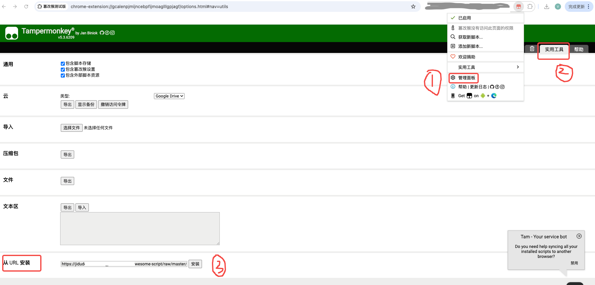
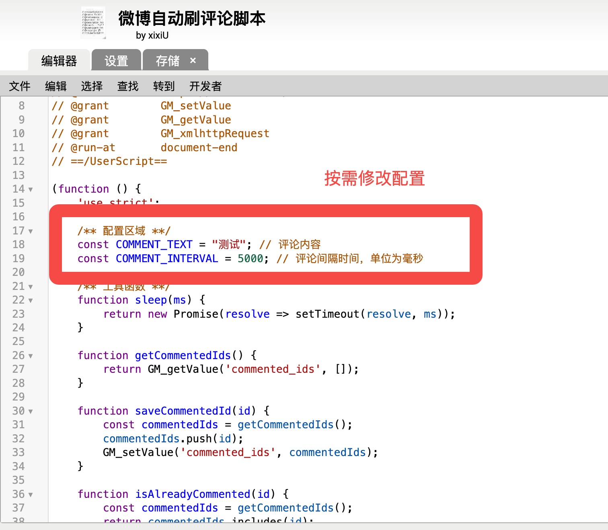
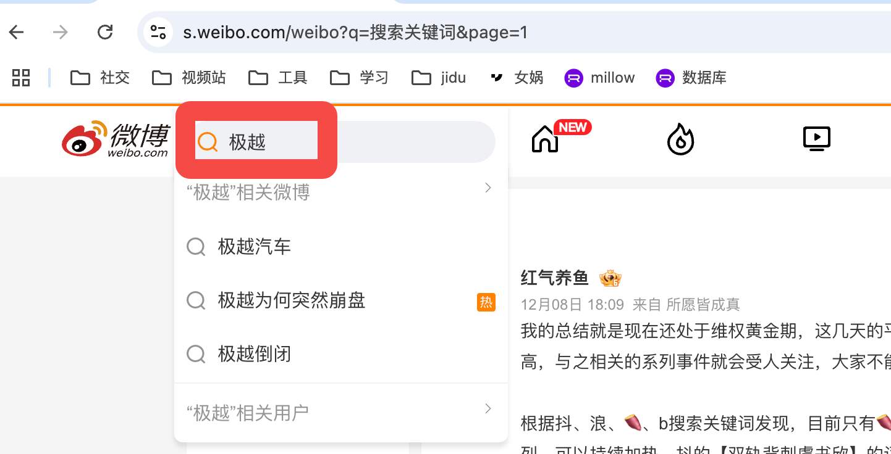

简介:微博批量自动评论 

说明：
搜索特定关键词之后，运行本脚本，可以批量自动评论(自定义评价内容)并翻页。

<strong style="color: red">请大家文明评论，本脚本仅供学习交流使用，请勿用于其他用途，本人不对此负任何责任。</strong>

## 1.安装浏览器脚本插件 

* Tampermonkey (新油猴) (又名:篡改猴) *<a href="https://www.tampermonkey.net/">插件安装链接</a>  
* Script Cat (脚本猫) (中国社区开发) *<a href="https://docs.scriptcat.org/">插件安装链接</a>
* Violentmonkey (暴力猴) *<a href="https://violentmonkey.github.io/get-it/">插件安装链接</a>
* Greasemonkey (旧油猴) *<a href="https://addons.mozilla.org/firefox/addon/greasemonkey/">插件安装链接</a>   注：Greasemonkey (旧油猴) 可能由于过于古老，无法支持该脚本。

## 2.安装脚本 

打开油猴-管理面板-使用工具-从URL安装。输入如下URL:<https://raw.githubusercontent.com/xixiU/awesome-script/refs/heads/master/weiboAutoComment/weibo_auto_comment.js>

## 3.使用

### 3.1安装并按需修改配置

<strong>请不要将间隔时间设置太小，会被风控。</strong>

### 3.2搜索你关心的关键词

等待即可，程序会自动执行

<video src='https://github.com/xixiU/awesome-script/raw/refs/heads/master/weiboAutoComment/images/usage.mp4" title="./images/usage.mp4'></video>

## 4.其他

程序会自动跳过已经评论内容，打开console可以看到详细信息
